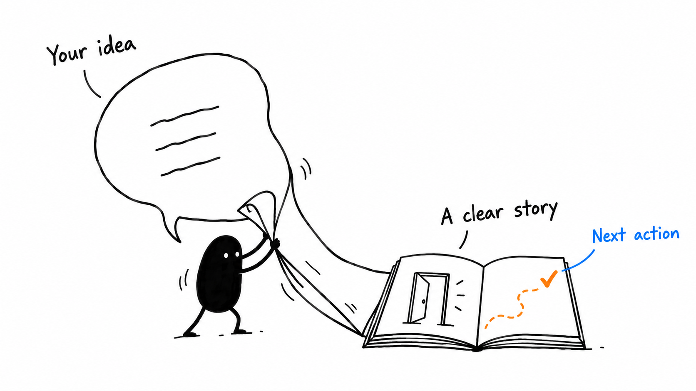

# Comic Explainer

**Turn a rough explanation into a comic people can remember and use.**

By **Mark Kentwell**, adapted from **Ian Xiaohei Illustrations** by [Ian (@ianneo_ai)](https://github.com/helloianneo/ian-xiaohei-illustrations). MIT licensed. This is a separate public fork of that one illustration skill, with a training and how-to workflow added.



## Start here

- **[Get the free starter pack](https://comic-explainer-by-mk.netlify.app/)** — the skill ZIP, quick-start PDF and starter prompts.
- **[Read the how-to guide](docs/QUICKSTART.md)** — what a skill is, installation and your first comic.
- **[See a working nine-scene training example](https://presence-four-ways-sales.netlify.app/#1)** — images, pop-outs, presenter notes and a recording mode.
- **[Open the skill](comic-explainer/SKILL.md)** — the instructions your agent reads.
- **[Understand the MIT licence](docs/LICENCE-EXPLAINED.md)** — plain English, with original sources.

If you came from Mark's video, **“comment EXPLAINER”** gets this pack. The installed skill is called **Comic Explainer** and its agent handle is **`$comic-explainer`**. “EXPLAINER” is the comment keyword; it is not a separate app.

## What it makes

A visual sequence from a voice note, transcript, training concept or how-to:

1. A storyboard with one memorable idea per scene.
2. Individual hand-drawn illustrations with short labels.
3. Concise talking points and suggested pacing.
4. An optional interactive presentation with expandable detail.
5. A practical next action for the audience.

An image-capable agent or connector is needed to render pictures. Without one, the skill can prepare the storyboard and prompts. It is a set of instructions, not a new AI model, renderer or hosting subscription. Usage charges for your chosen tools may apply.

## Your first prompt

```text
Use $comic-explainer.
Turn the explanation below into a six-scene comic for my team.
Label everything in English.
Make each scene teach one idea and show one clear physical action.
Add short talking points for a 10-minute walkthrough.
Finish with one action the team can practise today.
Generate the illustrations using the image tools available here.
Keep extra detail in the notes.

[Paste your explanation here.]
```

Ask for a plan first if you want to shape the story before generating. Ask for an interactive website and name your preferred host if you want a shareable deck. The skill does not publish anything by itself.

## Install in Codex

Download the starter ZIP and extract it. Copy the **`comic-explainer` folder**, including its references, licence and notice, into your Codex skills directory: `${CODEX_HOME}/skills` if you use a custom Codex home; otherwise `~/.codex/skills`. Do not copy only SKILL.md.

In a terminal, after cloning this repo:

```sh
git clone https://github.com/markkentwell-presence/comic-explainer.git
cd comic-explainer
skill_root="${CODEX_HOME:-$HOME/.codex}/skills"
mkdir -p "$skill_root"
if [ -e "$skill_root/comic-explainer" ]; then
  echo "Comic Explainer already exists. Preserve it before updating."
else
  cp -R ./comic-explainer "$skill_root/"
fi
```

Then start a new agent session and invoke `$comic-explainer`. On another skill-enabled agent, use its documented skill folder or ask it to install this specific public repo. In a regular chat interface without skill installation, provide SKILL.md and the linked references as instructions; that is not the same as an installed skill.

## What Mark changed

- English-first labels and a short, memorable name.
- A comic training arc, rather than isolated article illustrations.
- Speaker notes, timing, practice questions and a concrete final action.
- Optional interactive decks, with phone-friendly detail and a clean recording view.
- Explicit checks for counts, thresholds and spatial logic.
- Guidance for preserving editable sources and publishing only agreed material.

Ian's core visual language remains credited: white backgrounds, black hand-drawn linework, restrained coloured annotations, and the active, deadpan Xiaohei character. See [NOTICE.md](NOTICE.md) and [LICENSE](LICENSE). Mark's additions are also offered under MIT. This fork does not claim Ian's endorsement.

## Examples and updates

Try the [example prompts](examples/prompts.md). The current skill package is inside `comic-explainer/`; guides and images are outside it. No private business repository, client transcript, credential or team skill bundle is included.

Version: **1.0.0**. See [CHANGELOG.md](CHANGELOG.md). Keep your prior local version before updating. Suggestions can be raised as GitHub issues; there is no automated messaging or deployment setup in the skill.
